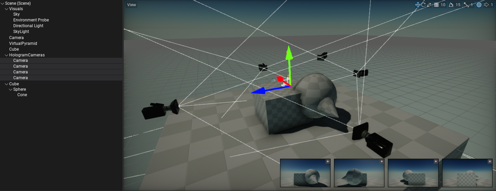
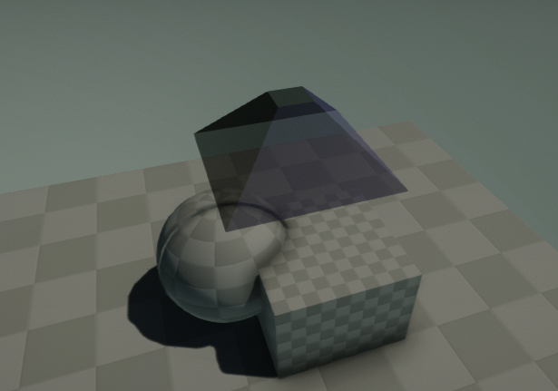
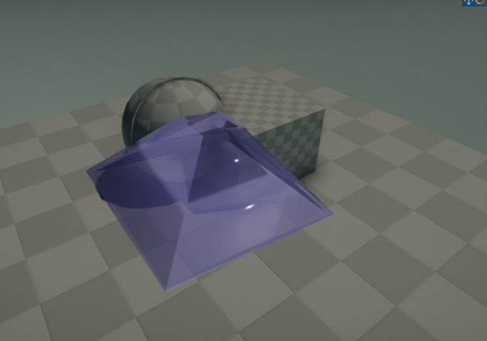
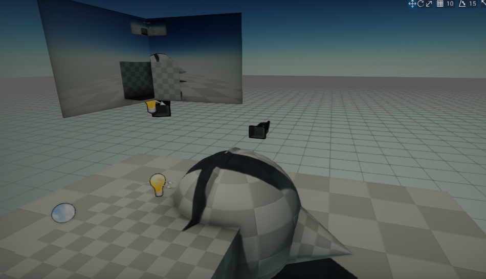
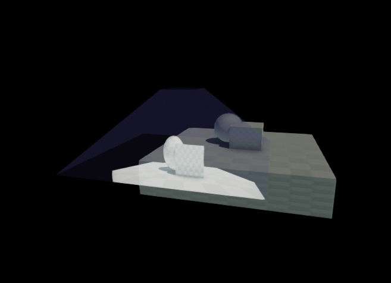

# Leonie Progress Blog - 1

# Cameras in FlaxEngine

I wrote a smol script that creates 4 cameras in the editor

# Virtual Glass Pyramid - Procedural Flax Edition

I wrote a bunch of scripts that can be used to create a procedural glass pyramid with a bunch of configureable parameters

# Virtual Glass Pyramid - Blender Edition

Do Stephan created a pretty pyramid model in Blender!

# Render to texture

I finally got rendering something to a texture to work properly. There were a number of issues such as it breaking when the scripts reload or not everything being disposed of properly. 

# Working "holograms"

# Code Details

1. 3/4 Cameras (`HologramPyramidCameras.cs`) 

2. Rendering pipeline (4 SceneRenderers) (`HologramRenderer.cs`)

3. Render to pyramid (`VirtualHologramPyramid.cs`) or render to screen (`ScreenHologramPyramid.cs`)

### Debug mode

1. Create a virtual glass pyramid 

   1. `HologramPyramid.cs`: "Mathematical" definition of a pyramid with a cut-off top

   2. `HologramPyramidGenerator.cs`: Creates a hologram pyramid

   3. `VirtualHologramPyramid.cs`: Uses the other classes to do stuff

2. Use the rendered images (`HologramRenderer.cs`) and render them to the hologram pyramid (`VirtualHologramPyramid.cs`)

### Used "libraries" (pieces of code I hacked together):

- `RenderingPipeline`: For quickly setting up fancy rendering pipelines (render this camera with those effects to that texture)

- `MeshGenerators`: For generating meshes
