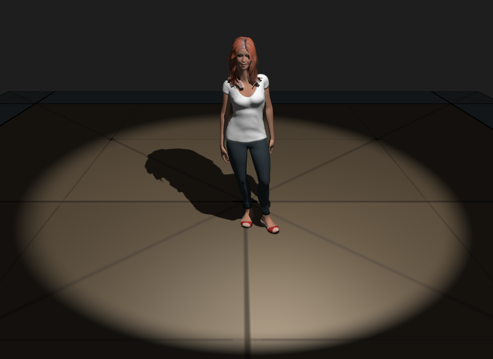
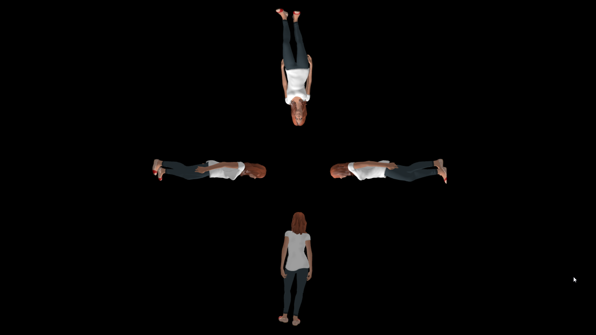

# Leonie Progress Blog - 2

# Leonie using PlayCanvas - first steps

[Fabian Prieschl](https://github.com/FabianPrieschl) imported the Leonie model, including textures into PlayCanvas, set up a bunch of pretty lights and...

Looks rather fancy! The shadows are really well made and the skin and hair are more realistic than they used to be.

# Multiple Leonie Views
Shoutout to Do Stephan! He implemented multiple Leonie views.

