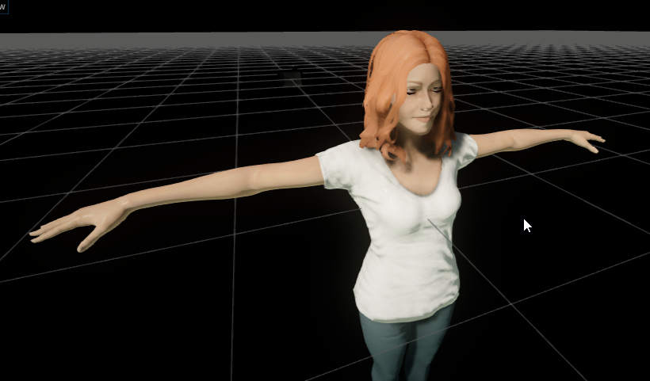
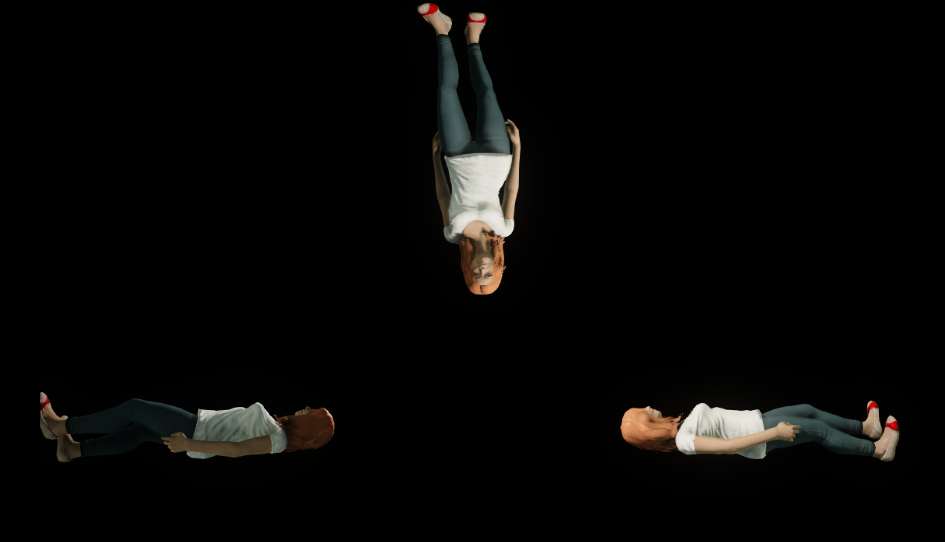
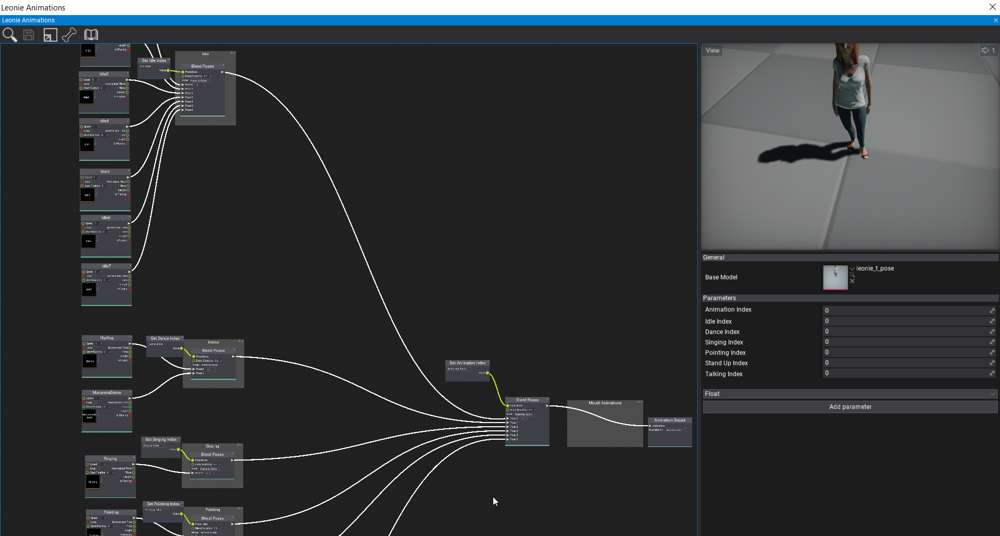

# Leonie Progress Blog - 3

## Leonie using FlaxEngine

PlayCanvas just didn't cut it, so we were working on a FlaxEngine version of the hologram renderer. This renderer has 3 main parts.

Here is a picture of Leonie in Flax.

## Triple View

1. 3 Cameras
2. RenderingPipeline from Stefnotch's CartoonShader Project
3. Display the 3 RenderTargets using a very fancy material/shader on a UICanvas

Things you can take a look at if you're unhappy with something like scaling

- `HologramPyramidCameras.DistanceFromOrigin`: Distance of the cameras. When you only want to see the top of Leonie, set this to a lower value.
- `ScreenHologramPyramid.Scale`: Stretching
- `HologramRenderer.Cameras.LeftCamera.CustomAspectRatio`: Camera Aspect Ratio

- UICanvas --> GUI.Image --> Keep Aspect Ratio: Currently `true`, in order to prevent any image stretching
- Shader itself

## Animation Playing

1. A big animation graph that has a bunch of integer parameters (which animation type, which animation exactly)
2. Some code that controls the parameters

Here is a pretty screenshot of a part of the animation graph

## Websockets

Those were fun /s! Hooray for Mono not shipping with a decent, built-in WebSocket.
I used a modified version of [Ninja.Websockets](https://github.com/ninjasource/Ninja.WebSockets). I hooked it up to the Wildfly Server, used the FlaxEngine built-in stuff to parse the JSON and played the animation with the correct:tm: name. 

