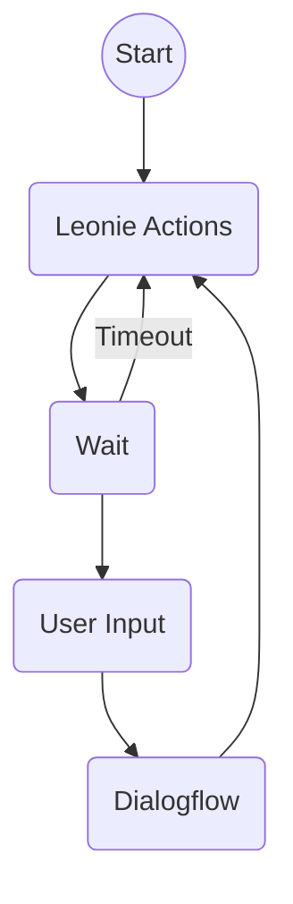

# Leonie Flowchart

## Software side

- Leonie Actions: Latest Dialogflow Response
  - Display
  - Speech
- Activate the user input components
  - Which will raise a `user-input` event
- Get the `user-input` event
  - If it's a timeout, go back to displaying the main menu (camera)
  - Otherwise, send it to Dialogflow and [restart the cycle again](https://youtu.be/qUiRhJgD76E?t=65)
