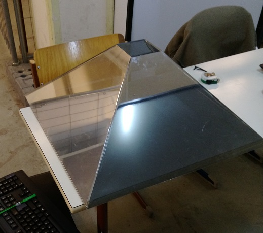
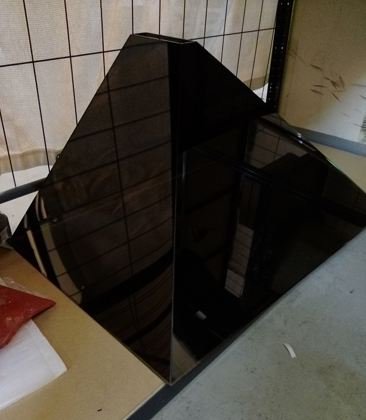

# Leonie Pyramiden
## Kleine Quadratische Pyramide

**Abmessungen**:
- Boden: 60x60 cm
- Oben: 10x10 cm
- Diagonale: 43 cm
- Hoehe: 24.5 cm

## Grosse Pyramide

- Spiegelt doppelt

**Abmessungen**:
- Boden: 90x60 cm (Vorne, Rechts/Links)
- Oben: 5.5x18.5cm (Vorne, Rechts/Links)
- Diagonale: 74.5 cm, 61.5cm (Vorne, Hinten)
- Hoehe: 45 cm
